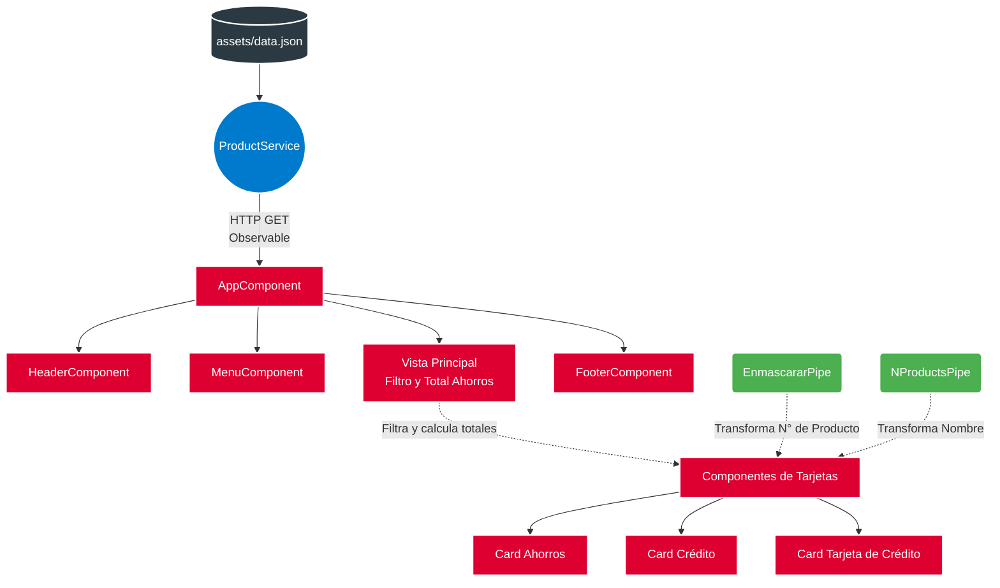

# Bank AVD 🏦

[](https://angular.io/)
[](https://getbootstrap.com/)
[](https://firebase.google.com/)
[](https://www.typescriptlang.org/)

Un moderno **Dashboard Bancario** desarrollado en Angular que permite a los usuarios visualizar, filtrar y gestionar sus productos financieros (Cuentas de Ahorros, Cuentas Corrientes, CDT, Créditos y Tarjetas de Crédito).

Este proyecto sirve como muestra de portafolio, demostrando buenas prácticas en el desarrollo frontend, consumo de datos asíncronos y diseño responsivo.

---

## 🚀 Funcionalidades Destacadas

*   **Visualización Centralizada:** Despliegue de los productos financieros divididos por tipo.
*   **Filtro Dinámico de Productos:** Por defecto, solo se muestran los productos pertenecientes a `BANCO_1`. Incluye un toggle para **"Mostrar otros productos"** que expande la vista a todo el portafolio.
*   **Cálculo en Tiempo Real:** El sistema calcula de forma dinámica el *Saldo Total de Ahorros* sumando los fondos disponibles o los valores de constitución, considerando únicamente los productos actualmente visibles.
*   **Seguridad y Privacidad:** Enmascaramiento automático de los números de cuenta y tarjetas mediante *Pipes* personalizados.
*   **Internacionalización (i18n) Básica:** Traducción y mapeo de los nombres de los productos al español (Ej: de `CURRENT_ACCOUNT` a `Cuenta Corriente`).
*   **UI/UX Responsivo:** Layout adaptativo y enfocado en la usabilidad construido sobre Bootstrap 4.

## 🏗️ Arquitectura de la Aplicación

La aplicación está diseñada bajo el patrón de componentes de Angular, promoviendo la reutilización y modularidad del código.



### Estructura de Directorios

La estructura principal dentro de `src/app/` sigue las mejores prácticas de Angular:

*   📂 **`component/`**: Contiene los bloques visuales reutilizables (`header`, `footer`, `menu`, `cards`).
*   📂 **`services/`**: Alberga la lógica de negocio y comunicación (`ProductService`).
*   📂 **`pipes/`**: Transformadores de datos visuales (`enmascarar.pipe`, `nproducts.pipe`).
*   📂 **`assets/`**: Recursos estáticos y mock data (`data.json`).

## 🛠️ Tecnologías y Herramientas

*   **Framework:** Angular 9
*   **Estilos:** CSS3, Bootstrap 4, FontAwesome 5
*   **Reactividad:** RxJS
*   **Testing:** Karma & Jasmine
*   **Despliegue:** Firebase Hosting

---

## ⚙️ Requisitos Previos

Para ejecutar este proyecto en tu entorno local, necesitas tener instalado:

*   [Node.js](https://nodejs.org/) (Versión 14 o 16 recomendada).
    > **Nota para usuarios de Node 18+:** Puede ser necesario configurar una variable de entorno antes de ejecutar el proyecto:
    > ```bash
    > # En Windows (CMD/PowerShell)
    > set NODE_OPTIONS=--openssl-legacy-provider
    > ```
    > ```bash
    > # En Linux/macOS
    > export NODE_OPTIONS=--openssl-legacy-provider
    > ```
*   [Angular CLI](https://angular.io/cli) (v9)

## 💻 Instalación y Ejecución Local

Sigue estos pasos para correr la aplicación:

1.  **Clonar el repositorio** (o descargar el código fuente):
    ```bash
    git clone https://github.com/tu-usuario/bankavd.git
    cd bankavd
    ```

2.  **Instalar dependencias**:
    Debido a que es un proyecto legacy en Angular 9, usa el flag `--legacy-peer-deps` para evitar conflictos con versiones modernas de npm.
    ```bash
    npm install --legacy-peer-deps
    ```

3.  **Iniciar el servidor de desarrollo**:
    ```bash
    npm start
    ```
    La aplicación estará disponible en `http://localhost:4200/`. La página se recargará automáticamente si haces cambios en el código.

## 📜 Scripts Disponibles

En el directorio del proyecto puedes correr los siguientes comandos:

| Comando | Descripción |
| :--- | :--- |
| `npm start` | Inicia el servidor de desarrollo local en el puerto 4200. |
| `npm run build` | Construye la aplicación para producción en el directorio `dist/`. |
| `npm test` | Ejecuta las pruebas unitarias vía Karma. |
| `npm run lint` | Ejecuta el análisis estático de código utilizando TSLint. |

---

## 🌐 Despliegue

La aplicación está lista para ser desplegada en **Firebase Hosting**.

1.  **Compilar para producción**:
    ```bash
    npm run build -- --prod
    ```
2.  **Desplegar**:
    ```bash
    firebase deploy
    ```
*(El proyecto actual está vinculado a la instancia de Firebase: `bankavd-b8251`)*

---

*Desarrollado con ❤️ para demostrar habilidades sólidas en Frontend y Arquitectura Angular.*
